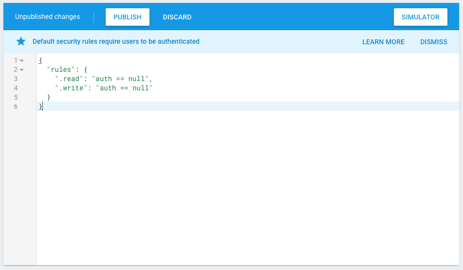

# Setting up an environment for labs

## Introduction
A target endpoint is needed in order to complete labs for Apigee Edge developer training. This lab will walk through how to setup the edge-developer-training-backend proxy and setup the [Firebase Realtime database](https://firebase.google.com/docs/database/).

When you create an Apigee Edge account, a Firebase Realtime Database is NOT automatically provisioned for you. Therefore, you must set this up first. Read the [docs](https://firebase.google.com/docs/database/) to learn more about Firebase.

As we work through the lab material we'll try to develop APIs for a fictitious e-commerce company called Moon Digital. This lab will setup a sample data store with APIs to act as Moon Digital's backend e-commerce services for product management, order management, inventory management, etc.

## Usage
### Prerequisites
You need the following items:
- Apigee Edge developer account. See [docs](http://docs.apigee.com/api-services/content/creating-apigee-edge-account) for more details on how to setup your account.
- [Node.js](https://nodejs.org/en/download/) installed on your local machine. This will also install node's package manage [npm](https://www.npmjs.com/).
- [Google Cloud Platform](https://accounts.google.com/signin/v2/identifier?service=cloudconsole&passive=1209600&osid=1&continue=https%3A%2F%2Fconsole.cloud.google.com%2Ffreetrial%3F_ga%3D2.45407329.414976149.1517252141-1035065838.1517252141%26ref%3Dhttps%3A%2F%2Fcloud.google.com%2F&followup=https%3A%2F%2Fconsole.cloud.google.com%2Ffreetrial%3F_ga%3D2.45407329.414976149.1517252141-1035065838.1517252141%26ref%3Dhttps%3A%2F%2Fcloud.google.com%2F&flowName=GlifWebSignIn&flowEntry=ServiceLogin) account. Please register and signin to your GCP console.    
- [Java SDK >= 8](http://www.oracle.com/technetwork/java/javase/downloads/index.html)
- [Maven 3.x](https://maven.apache.org/)
- Download the [setup.zip](../setup.zip) to your local machine and unzip it.


### Access Firebase Console and Import Data

1. Go to [https://firebase.google.com](https://firebase.google.com)

2. Click the **SIGN IN** button on the top right corner of the screen if you already have an account otherwise sign up for an account.


3. Click the **+ Add project** button shown below to create a new project.


4. On the Add a Project screen enter the following and then click the **Create Project** button.
  * apigee-developer-training-db


5. Click **Develop** > **Database** and then click the **GET STARTED** button.


6. You will see the database url to access your Firebase instance. Currently there is no data in your database.  


7. Now you are going to import all the data into Firebase.  Click the 3 dots located on the right of the your screen. Then click **Import JSON**.


8. Click the **Browse** button and select the **firebase-all.json** file located in the `setup/data` directory. This is the setup.zip file that you downloaded earlier. Then click the **IMPORT** button.


9. You can see all the data was loaded successfully.  


### Update Firebase Rules
The next step is update the Firebase rules so that the database is available for reads and writes without a login credential.  

1. From the Firebase Console, click the **Rules** tab.  


2. The rules are set to require a valid auth instance to read or write data to the database.


3. Copy and paste the JSON below into your Rules window.  

```json
{
  "rules": {
    ".read": "auth == null",
    ".write": "auth == null"
  }
}
```

4. Click the **Publish** button.  When you are not using the database, then change the rules back to its original format to require a valid auth instance.  



```json
{
  "rules": {
    ".read": "auth != null",
    ".write": "auth != null"
  }
}
```


### Firebase REST API

You can access the Firebase JSON objects as shown below to test it.  However, the proxies that you develop during this training will access Firebase through the **edge-developer-training-backend** proxy that you will setup next.    

```
curl -X GET https://your-projectname.firebaseio.com/db/carts.json
curl -X GET https://your-projectname.firebaseio.com/db/categories.json
curl -X GET https://your-projectname.firebaseio.com/db/orders.json
curl -X GET https://your-projectname.firebaseio.com/db/products.json
curl -X GET https://your-projectname.firebaseio.com/db/skus.json
curl -X GET https://your-projectname.firebaseio.com/db/stores.json
curl -X GET https://your-projectname.firebaseio.com/db/users.json
```

You can access individual items by providing the item id in the JSON object.  
```
curl -X GET https://your-projectname.firebaseio.com/db/carts/4b1e4bda.json
curl -X GET https://your-projectname.firebaseio.com/db/users/joe.json
```

## Deploy the edge-developer-training-backend proxy and dependencies
In this section you are going to deploy the edge-developer-training-backend proxy to Apigee Edge and deploy all of the required dependencies such as the Apigee Product, App and developer.  

1.  Now you need to open a terminal window and cd into the setup directory.  This directory should have been created when you downloaded the setup.zip file earlier.  
```
cd setup
```

Then execute the following:
```
npm install

node setup

```

This will prompt you to provide Apigee org, env and user credentials along with the Firebase host name. Once its provided correctly, the script runs and deploys the backend proxies in your Apigee instance.

For example - 

```
$ node setup
prompt: Please provide the Apigee Edge username:  abc@example.com
prompt: Please provide the Apigee Edge password:  ************

prompt: Please provide the Apigee Edge Organization name:  testOrg
prompt: Please provide the Apigee Edge Environment name:  test
prompt: Please provide the Firebase Host name:  apigee-engg-training-2343432.firebaseio.com

```

## Note
All of the material here is released under the [MIT license](https://github.com/apigeecs/Edge-Dev-Training/blob/master/LICENSE.md)

## Support
If you have any questions, please get in touch with your training instructor or search and ask questions on [community](https://community.apigee.com/index.html)
